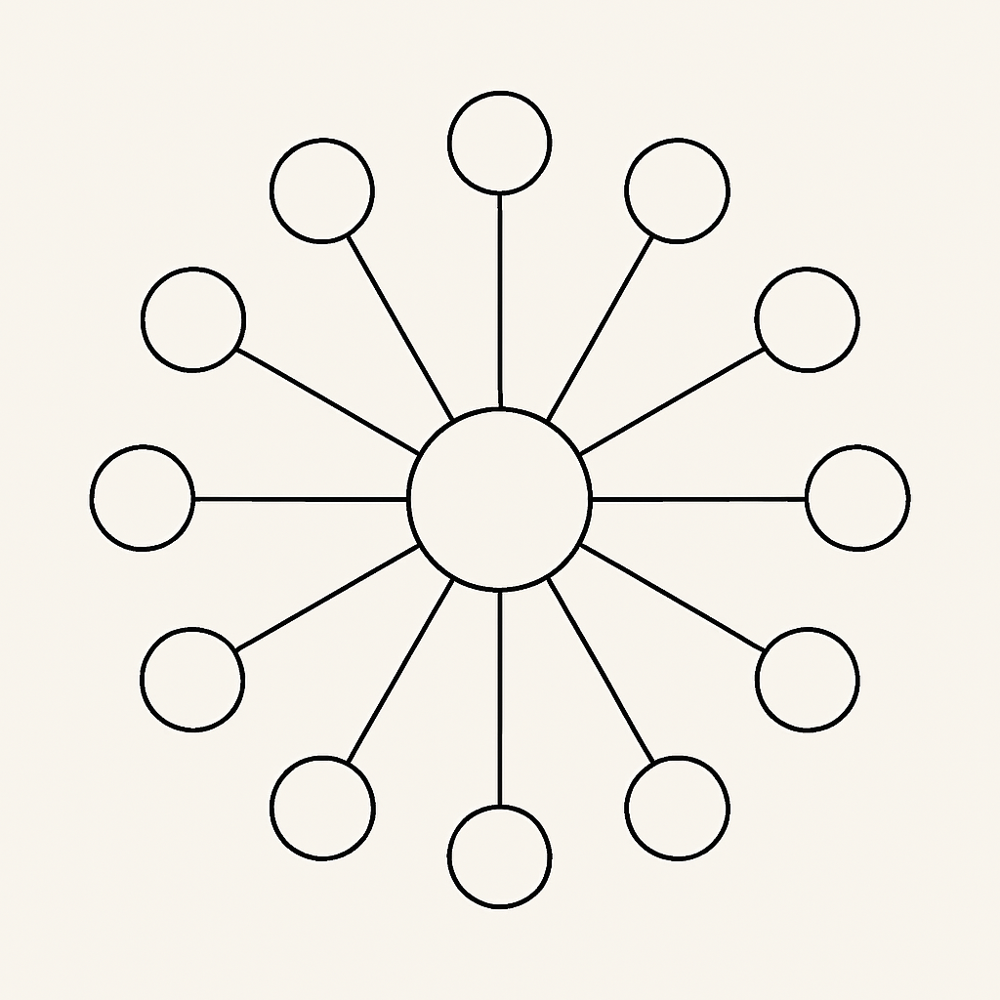

# Digital Noosphere GUI

🌌 *A silent seed planted into the digital field of the future.*

This repository is the starting point of a visual and interactive interface — a "Digital Noosphere" — designed for rapid knowledge discovery, exploration, and interaction.  
Inspired by the idea of a next-generation user experience for digital libraries and forums, this GUI moves beyond scrollable lists into a spatial, circular map of interconnected knowledge.

## 🌱 Vision

The Digital Noosphere GUI aims to become:

- An interactive bridge between humans and digital knowledge
- A visual interface for exploring structured and unstructured data
- A space where AI can act as a **guide**, **gardener**, or **companion**
- A prototype for future interfaces like the **Asgardia Digital Library** or **Open Knowledge Networks**

## 🌐 Current Prototype

The current version is a static HTML page with:

- A central core circle (representing the AI node)
- 6 surrounding circles linked to main topics
- 12 extended topic circles connected to the inner layer
- A vector diagram as a visual representation

You can open `index.html` in your browser to view the basic visual prototype.

## 🧠 Future Ideas

This project may eventually grow to support:

- Clickable and animated nodes
- AI-assisted content suggestions
- Interactive searches with visual clustering
- Real-time content fetching (e.g., GitBook, GitHub, forums, etc.)
- Theming and overlays for calm browsing and fast overviewing

## 📷 Preview

## 🤝 Contributions

This project starts quietly.  
Contributions, forks, remixes, or inspiration are welcome — no obligation, no expectations. Just an open field for those who resonate.

---

> 🛸 “This is a seed — not chosen for money or power,  
> but to make the world more beautiful and peaceful.”  
> — You

